# 访问地址
http://114.55.249.21

# 主要界面展示
## 首页

## 登录注册页
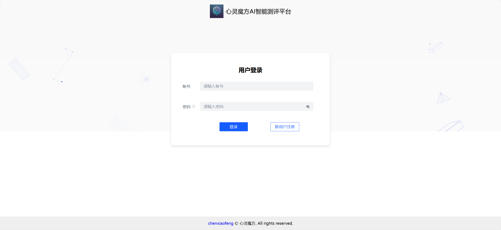
## 登录后页面

## 应用详情页
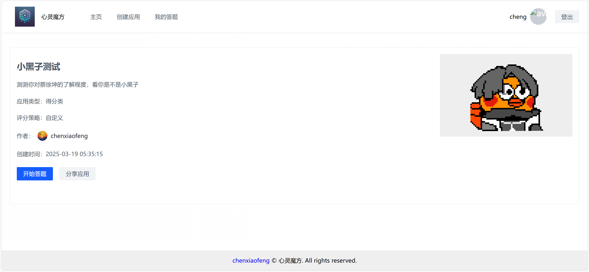
## 应用分享
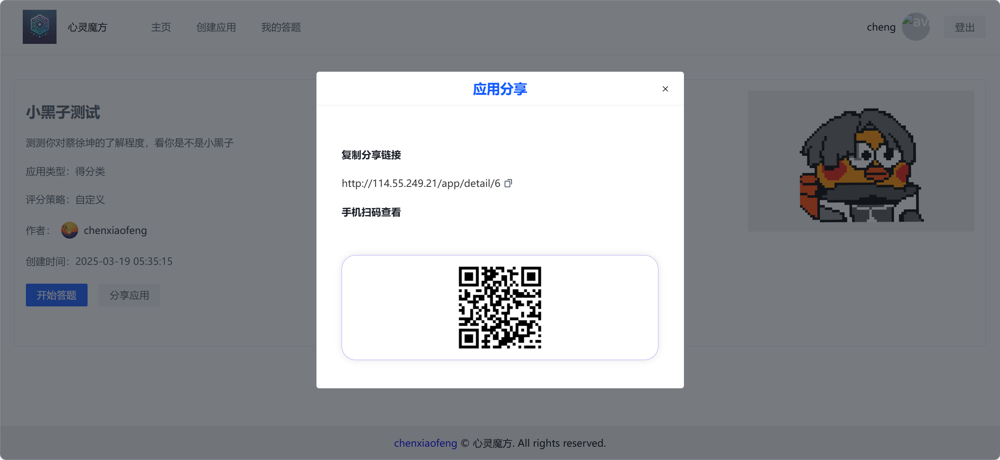
## 答题页面
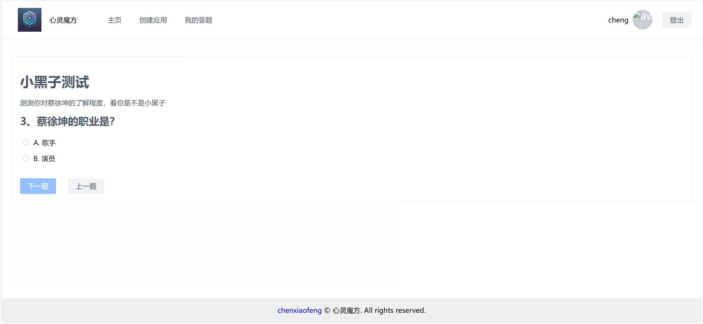
## 结果页面
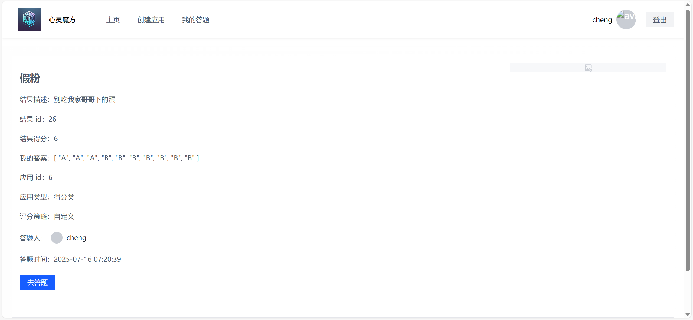
## 个人答题记录页面
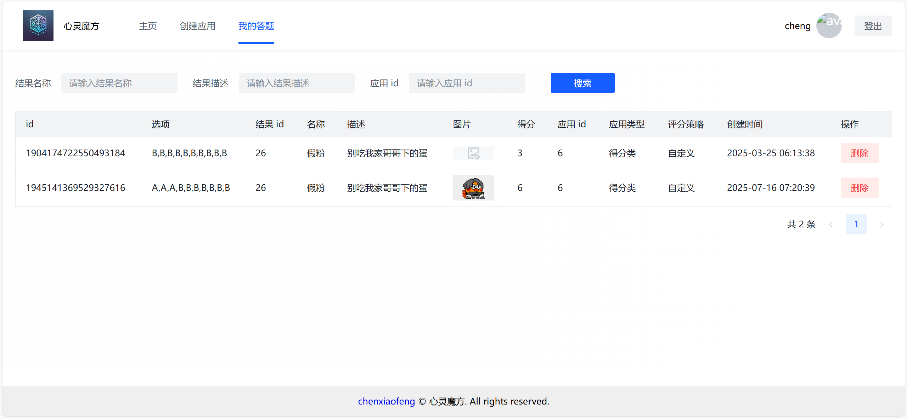
## 创建应用、AI生成题目
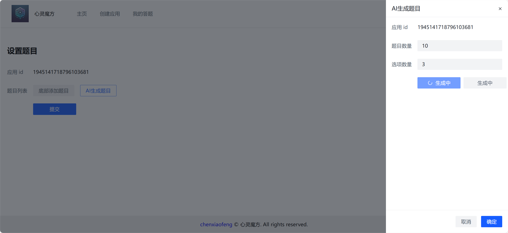
## 编辑AI生成题目
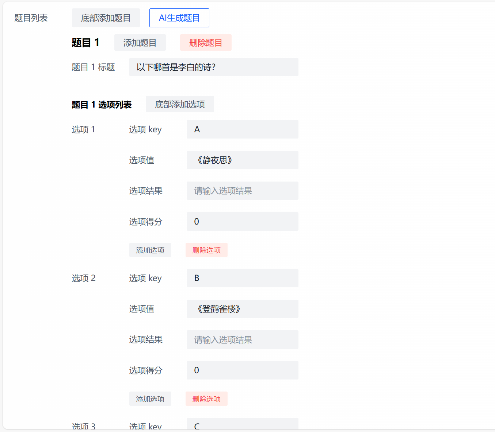
## 生成应用展示
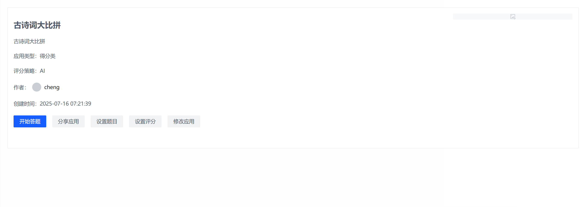
## 管理员页面

## 用户管理
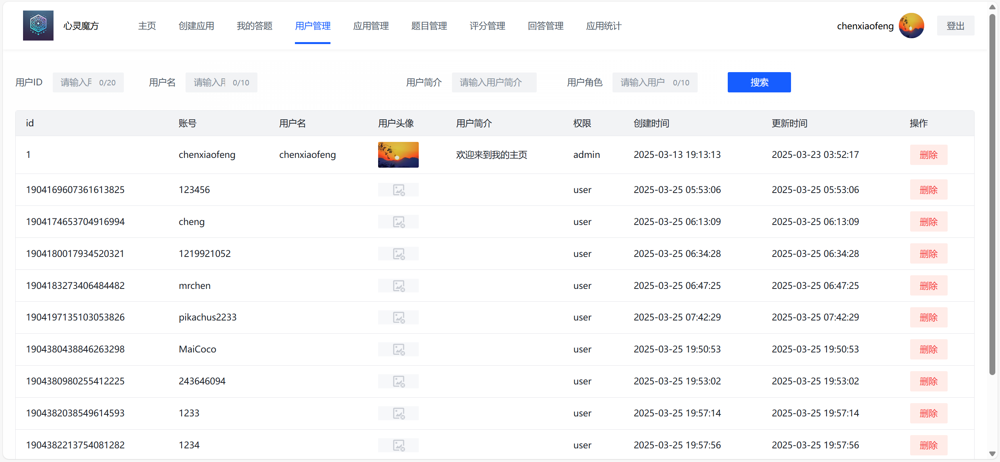
## 应用管理
用户刚创建的应用需要管理员审核通过后其他用户才可以访问
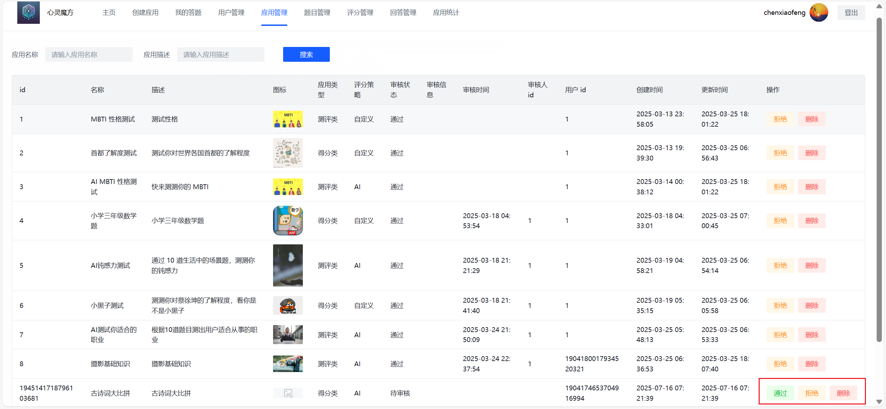
## 题目管理
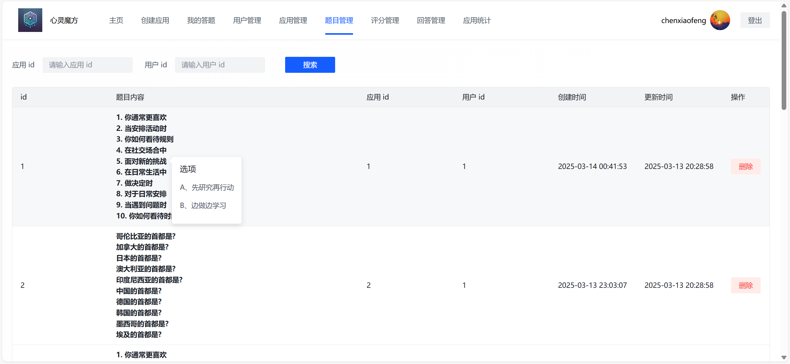
## 评分管理
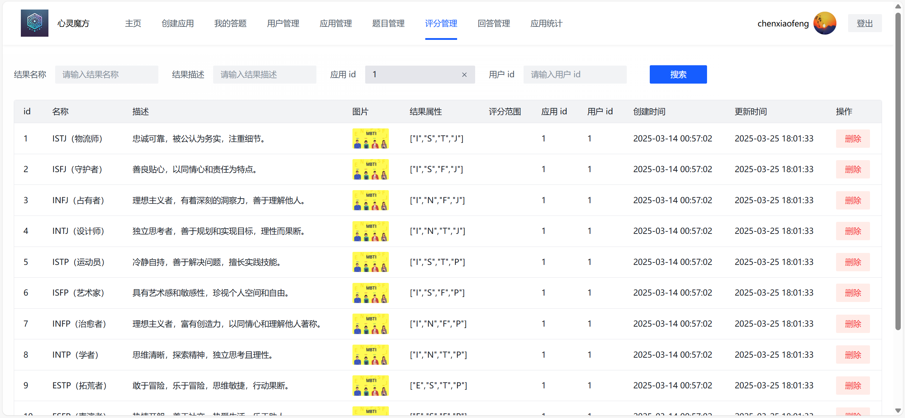
## 回答管理
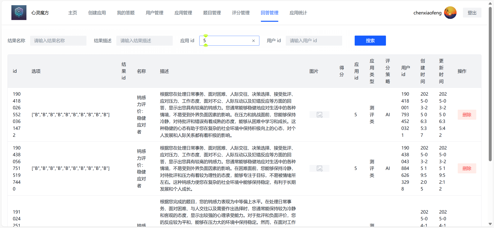
## 应用使用统计可视化
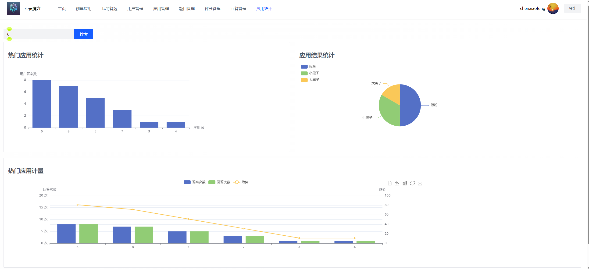
